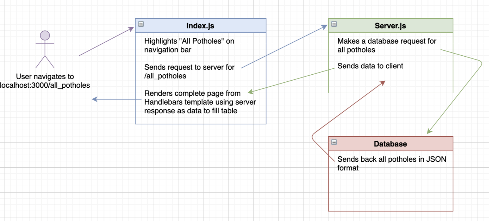
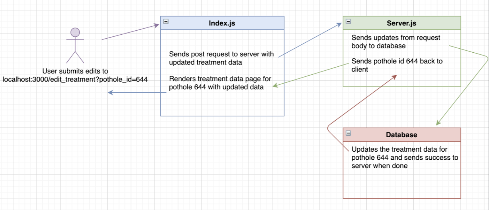
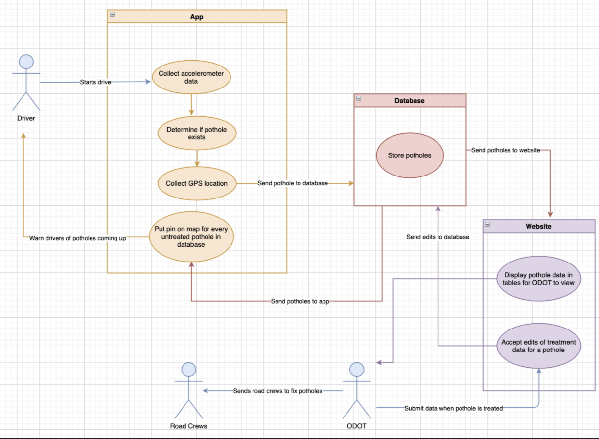

# Pothole-Detection-Website
This is the website interface for ODOT employees to access data from potholes that were detected by the pothole detection iOS app (github.com/cade-conklin/Pothole-Detection)

## Installation
Start by simply cloning the repository to your machine. Then run
``` bash
npm install
```

## Running
I am currently just running this on localhost. You can run it on your own computer by navigating to the directory and running:
``` bash
node server.js
```
Then visit localhost:3000/active_potholes. If you have issues with the port you can change the port number in Pothole-Detection-Website/server.js

## Details about the code structure
Here is a high level overview of how viewing pothole data works:


And here is one of how editing treatment data works:


Finally, here is how the app and website interact:


## Changes that are left to be made 
More information to come!
